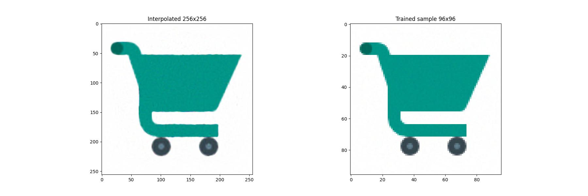
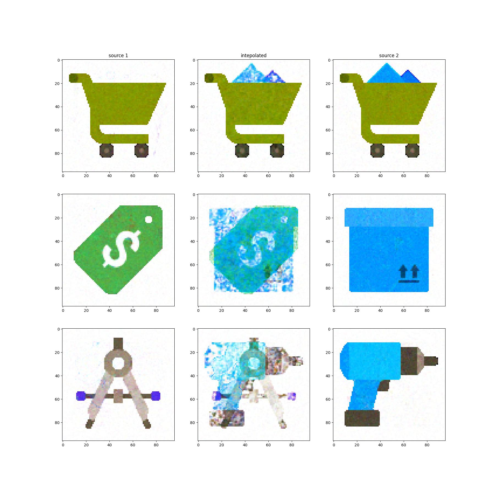

# Multipale Image Neural Representations
Based on 
[Implicit Neural Representations with Periodic Activation Functions](https://github.com/vsitzmann/siren)

## Setup enviroment

Setup a conda environment with all dependencies like so:
```
conda env create -f environment.yml
conda activate ImageRep
```
## Train image representation
run training

```
python train.py
```
Please make sure to login to [wandb](https://docs.wandb.ai/quickstart) before staring training.
The checkpoints stored at "output" folder.

Hyperparameters configuration option can be changed by
<pre>
usage: train.py [-h] [--name NAME] [--in_features IN_FEATURES]
                [--out_features OUT_FEATURES]
                [--hidden_features HIDDEN_FEATURES]
                [--hidden_layers HIDDEN_LAYERS]
                [--outermost_linear OUTERMOST_LINEAR]
                [--first_omega_0 FIRST_OMEGA_0]
                [--hidden_omega_0 HIDDEN_OMEGA_0] [--drop_out DROP_OUT]
                [--train_workers TRAIN_WORKERS] [--limit LIMIT]
                [--batch_size BATCH_SIZE] [--lr LR] [--wd WD]
                [--schedule_step SCHEDULE_STEP] [--cach CACH]
                [--train_dataset_path TRAIN_DATASET_PATH]
                [--validation_dataset_path VALIDATION_DATASET_PATH]
</pre>


Training convergence that I have conducted , [exp1](https://wandb.ai/rusalmighty/Image%20Representation%20Experiment/runs/o8ehlbdz?workspace=user-)
### Evaluate
to produce evaluation images
```
python eval_trained.py [checkpoint path]
```
the result will be two image

#### Size Interpolation



#### Image Index Interpolation




